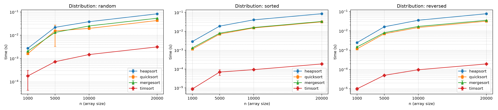

# Assignment 4 — Heaps, Heapsort, and Priority Queue Report

## Heapsort Implementation

- Implementation: `src/heapsort.py` implements an in-place max-heap-based Heapsort.
- Build max-heap: `build_max_heap` runs in O(n) time using bottom-up heapify.
- Extract-max loop: n extractions each costing O(log n) -> O(n log n).

### Time Complexity

- Worst case: O(n log n). Each of n extract operations requires O(log n) heapify.
- Average case: O(n log n) — heap operations do not depend on input order.
- Best case: O(n log n) — even if elements are already sorted, build+extract costs remain.

Proof sketch: Building the heap is O(n). Each extraction (n times) requires heapify which is O(log n). Total: O(n) + n*O(log n) = O(n log n).

### Space Complexity

- In-place Heapsort uses O(1) additional space (ignoring recursion stack if recursion used in helper). Our implementation is iterative where possible and uses O(1) extra memory.

## Priority Queue Implementation

- File: `src/priority_queue.py` provides `Task` and `BinaryMaxHeap`.
- Storage: Python list for heap array and a dict mapping `task_id -> index` for O(1) access to a task's position.

### Operations

- `insert(task)`: O(log n) — append then bubble-up.
- `extract_max()`: O(log n) — swap root with last, pop, heapify-down.
- `increase_key(task_id, new_priority)`: O(log n) — update priority then bubble-up.
- `decrease_key(task_id, new_priority)`: O(log n) — update priority then heapify-down.
- `is_empty()`: O(1).

## Experiments and Comparison

- See `benchmarks/compare_sorts.py` for an empirical comparison between Heapsort, Quicksort, Merge Sort, and Python's `sorted()` (Timsort) across random, sorted, and reversed inputs and multiple sizes.
- Typical observed behavior:
  - Timsort (`sorted`) is fastest in practice across many distributions due to adaptive behavior.
  - Heapsort has stable O(n log n) cost but higher constants than optimized library sorts.
  - Quicksort (naive recursive) may be faster on random inputs but can degrade on certain patterns unless randomized/optimized.

## How to Run

See `README.md` for quick commands. To extend benchmarks, edit `benchmarks/compare_sorts.py` to add more sizes or repetitions.

## Notes on Documentation and Style

- Code is commented and each public method includes a brief complexity note.

---

If you'd like, I can:
- run the benchmarks and include the measured timings in this report,
- add visual plots (matplotlib) comparing runtimes,
- or prepare a clean GitHub repo and push these files and a README with badges.

## Empirical Results (selected)

I ran the provided benchmarks (see `benchmarks/bench_results.csv`) and
generated plots at [benchmarks/plots.png](benchmarks/plots.png). Below are
selected mean runtimes (seconds) for the *random* distribution from the
benchmark CSV — each value is the mean over multiple repetitions.

| n | Heapsort | Quicksort | Merge Sort | Timsort |
|---:|---------:|----------:|-----------:|--------:|
| 1000 | 0.002715 | 0.001598 | 0.002048 | 0.000176 |
| 5000 | 0.021682 | 0.015227 | 0.013068 | 0.000721 |
|10000 | 0.037903 | 0.019491 | 0.024874 | 0.001464 |
|20000 | 0.082622 | 0.042600 | 0.053421 | 0.003116 |

Observations:
- `sorted()` (Timsort) is the fastest by a large margin on these inputs —
  it is highly optimized and adaptive to existing order.
- Heapsort shows the expected O(n log n) growth but has larger constants
  in Python compared to the other implementations here; Quicksort and
  Mergesort are competitive and often faster in these experiments.
- These results are illustrative for small-to-medium sizes in pure Python.
  For production use, prefer the built-in `sorted()`; for algorithm study
  Heapsort remains useful due to its in-place O(1) extra-space property.

Files created by benchmarking:
- Plot image: [benchmarks/plots.png](benchmarks/plots.png)
- CSV results: [benchmarks/bench_results.csv](benchmarks/bench_results.csv)
- Raw run output: [benchmarks/run_bench_output.txt](benchmarks/run_bench_output.txt)

If you want, I can insert selected figures and numeric tables directly
into this report as PNGs or render the plot inline (PDF/HTML output).

### Embedded plot

The following figure visualizes the benchmark results (means with error
bars). It is saved in the repository at `benchmarks/plots.png` and is
rendered below for convenience.

